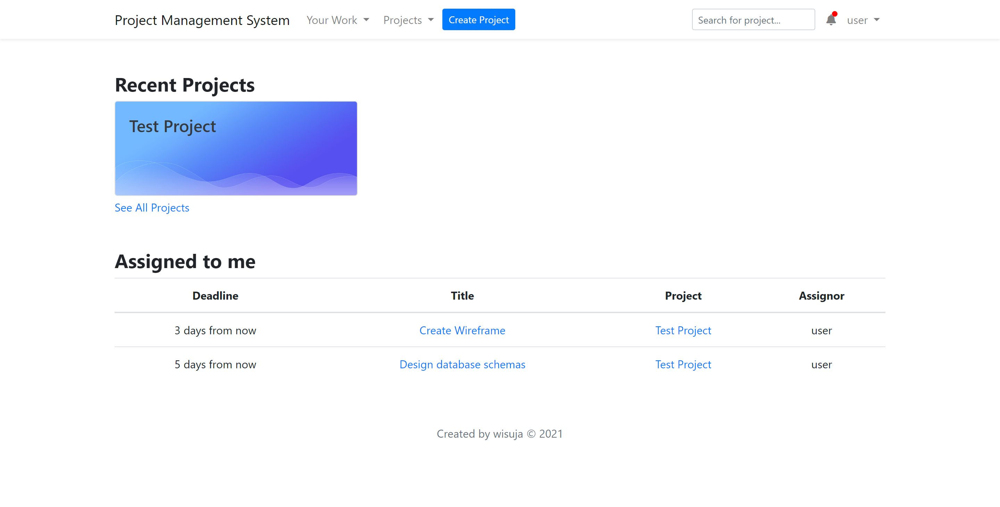

# Project Management System

This project was built to help project managers handle multiple projects at once. The application implemented Scrum methodology and used Machine Learning to calculate time required to complete a task. This project needs [Time Estimator API](https://github.com/wisuja/flask-time-estimator-api) to run also.
 

The application was built using Laravel 8 and JQuery. This application also requires [Algolia](https://algolia.com) library to work.

## Steps to run this application:

1. Click on `<> Code` button
2. Copy the HTTPS/SSH repository link
3. Run `git clone` command on your terminal.
4. Install the necessary dependencies by running `composer install`
5. Creating .env file by `cp .env.example .env` and fill in the necessary fields, e.g.: database connection, algolia credentials, api endpoint, etc.
6. Generate the application key by running `php artisan key:generate`
7. Next, run the database migration with this `php artisan migrate` command.
8. You can seed the database with `php artisan db:seed` command.
9. Lastly, serve the application with this `php artisan serve` command.
10. The Project Management System application should accessible on your browser on "http://localhost:8000"

### Time Estimator API Server repository: [Click here](https://github.com/wisuja/flask-time-estimator-api)

## Key Features

-   Projects managements
-   Kanban-like task managements
-   Sprint & Backlog
-   Time estimation feature
-   Users management
-   In-app Notification

## Screenshots

**Dashboard Screen**

**Project Detail - Main Screen**

**Project Detail - Create Task Screen**

> ℹ️ Information
>
> In this screen, as you can see under Deadline field. There is an <u>Estimated time</u> data. This comes from the Time Estimator API.

**Project Detail - Board View Screen**

**Project Detail - Setting Screen**

**Notification**

